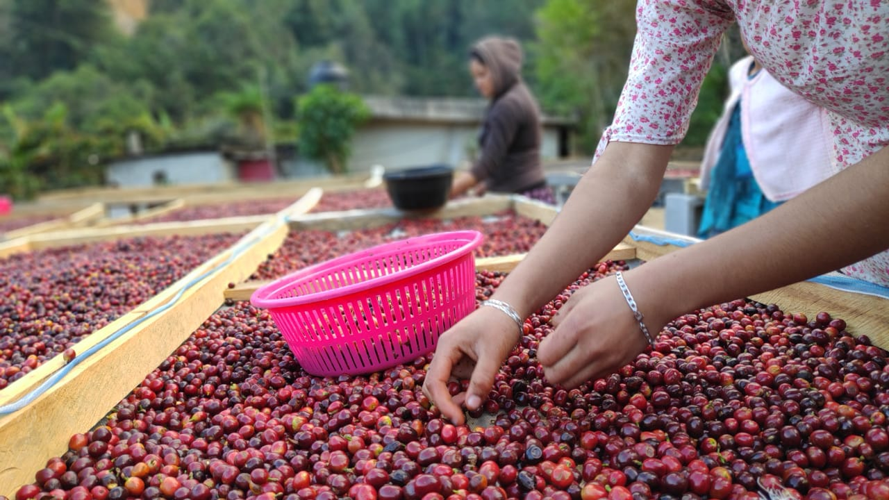

# ☕ Cafe-Solana


> Smart Contract en Solana para el registro y trazabilidad de cafés mexicanos en la blockchain.

---

## ¿Qué es Cafe-Solana?



Cafe-Solana es un programa desplegado en la **blockchain de Solana** que permite a productores de café registrar sus productos de forma inmutable. Cada café queda almacenado como una cuenta única (PDA) con información de su **marca**, **región de origen**, **calidad** y **estado** en la cadena de suministro.

Desarrollado con **Rust** y el framework **Anchor** como parte del Bootcamp de certificación de la **Solana Foundation**.

---

## Instrucciones del Programa

| Instrucción        | Acción     | Descripción                                            |
| ------------------ | ---------- | ------------------------------------------------------ |
| `registrarCafe`    | **CREATE** | Registra un nuevo café en la blockchain                |
| `fetch` / `all`    | **READ**   | Lee los datos de uno o todos los cafés desde el client |
| `actualizarEstado` | **UPDATE** | Cambia el estado del café (ej. "Tostado", "Exportado") |
| `eliminarCafe`     | **DELETE** | Elimina la cuenta y devuelve los SOL de renta          |

---

## Estructura de Datos

Cada café se almacena en su propia cuenta PDA con los siguientes campos:

```rust
pub struct Cafe {
    pub productor: Pubkey,  // Wallet del productor
    pub id_cafe: u64,       // ID único del café
    pub marca: String,      // "Café Chiapaneco Premium"
    pub region: String,     // "Chiapas", "Oaxaca", "Veracruz"
    pub calidad: String,    // "Especialidad", "Premium", "Gourmet"
    pub estado: String,     // "En producción", "Tostado", "Exportado"
}
```

La dirección de cada cuenta se deriva con las semillas:

```
["cafe", productor_wallet, id_cafe]
```

Esto garantiza que cada café tenga su propia cuenta sin colisiones y que **solo el productor original** pueda modificarla o eliminarla.

---

## Cómo Ejecutarlo

### 1. Importar en Solana Playground

Copia el enlace de tu repositorio y ábrelo en [Solana Playground](https://beta.solpg.io/):

```
https://beta.solpg.io/github.com/IrvingRGH/Cafe-Solana
```

Haz clic en **Import** y asigna un nombre.


### 2. Conectar Wallet

Haz clic en **Not Connected** (parte inferior izquierda) para conectarte a la **Devnet** y crear tu wallet de prueba.


Pide SOL de prueba en la terminal:

```bash
solana airdrop 2
```

### 3. Build & Deploy

1. Clic en **Build** — espera la marca verde de compilación exitosa
2. Clic en **Deploy** — espera el mensaje _"Deployment successful"_

### 4. Ejecutar Pruebas

En la terminal de SolPG escribe:

```bash
run
```

Esto ejecuta `client/client.ts` que realiza el ciclo CRUD completo:

```
Iniciando pruebas del contrato Cafe-Solana...

📍 PDA derivada para el café: 3fyKakf122xDLwSGoRUXCNvsVPVZs4XMV88ZJMEGE3Pr

--- 1. CREANDO REGISTRO DE CAFÉ ---
✅ Transacción de creación exitosa. Hash: 5tuxSV3j3EDVn...

--- 2. LEYENDO DATOS DEL CAFÉ ---
☕ Datos extraídos de la PDA:
   - Productor: 32m677WjVaxJhYYrcnRA18WNjrXnYVyfpdcbQdHyoRCD
   - ID del Café: 1
   - Marca: Café Chiapaneco Premium
   - Región de origen: Chiapas
   - Calidad: Especialidad
   - Estado actual: En producción

--- 3. ACTUALIZANDO ESTADO DEL CAFÉ ---
✅ Transacción de actualización exitosa.
🔄 Nuevo estado verificado en la blockchain: Tostado y Exportado

--- 4. ELIMINANDO REGISTRO DEL CAFÉ ---
✅ Transacción de eliminación exitosa.
💰 La cuenta fue cerrada y los tokens SOL de 'rent' han vuelto a tu wallet.

☕ ¡Prueba del CRUD de Cafe-Solana completada con éxito!
```

---

## Estructura del Proyecto

```
Cafe-Solana/
├── src/
│   └── lib.rs          # Smart Contract (Rust + Anchor)
├── client/
│   └── client.ts       # Script de pruebas CRUD (TypeScript)
├── tests/
│   └── anchor.test.ts  # Tests unitarios
├── images/             # Imágenes del README
└── README.md
```

---

## Seguridad

- Cada PDA se deriva de `["cafe", wallet, id]` — cuentas únicas por productor y café
- La macro `has_one = productor` impide que alguien que no sea el dueño modifique o elimine un café
- Al eliminar un café, la cuenta se cierra con `close` y los SOL de renta regresan al productor

---

## Tecnologías

| Herramienta           | Uso                                 |
| --------------------- | ----------------------------------- |
| **Rust**              | Lógica del Smart Contract           |
| **Anchor**            | Framework para desarrollo en Solana |
| **TypeScript**        | Client de pruebas e integración     |
| **Solana Devnet**     | Red de pruebas para despliegue      |
| **Solana Playground** | IDE en el navegador                 |

---

## Autor

Desarrollado por **Irving RGH** como parte del Bootcamp de certificación Solana Developer de la Solana Foundation.
